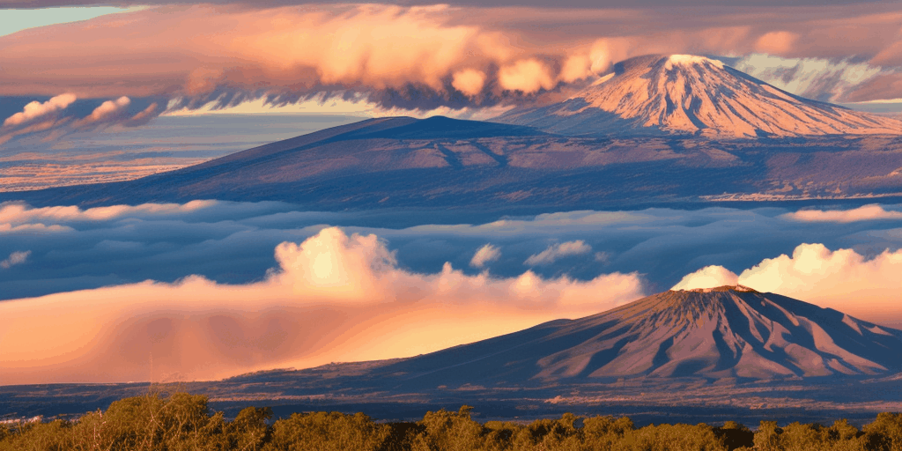

<div align="center">
<!-- <h1>360DVD</h1> -->
<h3>360DVD: Controllable Panorama Video Generation with 360-Degree Video Diffusion Model</h3>

[Qian Wang](https://akaneqwq.github.io/),[Weiqi Li](https://github.com/lwq20020127/), [Chong Mou](https://github.com/MC-E/), [Xinhuang Cheng](https://cxh0519.github.io/), [Jian Zhang](https://jianzhang.tech/)

School of Electronic and Computer Engineering, Peking University

<!-- [](https://arxiv.org/abs/) -->
[](https://github.com/akaneqwq/360DVD/blob/main/__assets__/360DVD.pdf)
[](https://akaneqwq.github.io/360DVD/)
<!-- []() -->

This repository is the official implementation of 360DVD, a panorama video generation pipeline based on the given prompts and motion conditions. The main idea is to turn a T2V model into a panoramic T2V model through 360-Adapter and 360 Enhancement Techniques.

</div>

## Gallery

We have showcased some regular videos generated by [AnimateDiff](https://github.com/guoyww/AnimateDiff) and panoramic videos generated by 360DVD below. 

More results can be found on our [Project Page](https://akaneqwq.github.io/360DVD/).

<table>
  <tr>
    <td></td>
    <td></td>
    <td></td>
    <td></td>
  </tr>
  <tr>
    <td colspan="2"><center>"the top of a snow covered mountain range, with the sun shining over it"</center></td>
    <td colspan="2"><center>"a view of fireworks exploding in the night sky over a city, as seen from a plane"</center></td>
  </tr>
  <tr>
    <td></td>
    <td></td>
    <td></td>
    <td></td>
  </tr>
  <tr>
    <td colspan="2"><center>"a desert with sand dunes, blue cloudy sky"</center></td>
    <td colspan="2"><center>"the city under cloudy sky, a car driving down the street with buildings"</center></td>
  </tr>
  <tr>
    <td></td>
    <td></td>
    <td></td>
    <td></td>
  </tr>
  <tr>
    <td colspan="2"><center>"a large mountain lake, the lake surrounded by hills and mountains"</center></td>
    <td colspan="2"><center>"a volcano with smoke coming out, mountains under clouds, at sunset"</center></td>
  </tr>
</table>

Model: [Realistic Vision V5.1](https://civitai.com/models/4201/realistic-vision-v20)

## To Do List
- [ ] Release dataset
- [ ] Release weights
- [ ] Release code
- [x] Release paper

## Contact Us
**Qian Wang**: [qianwang@stu.pku.edu.cn](mailto:qianwang@stu.pku.edu.cn)

## Acknowledgements
Codebase built upon [AnimateDiff](https://github.com/guoyww/AnimateDiff).

## BibTeX
```

```